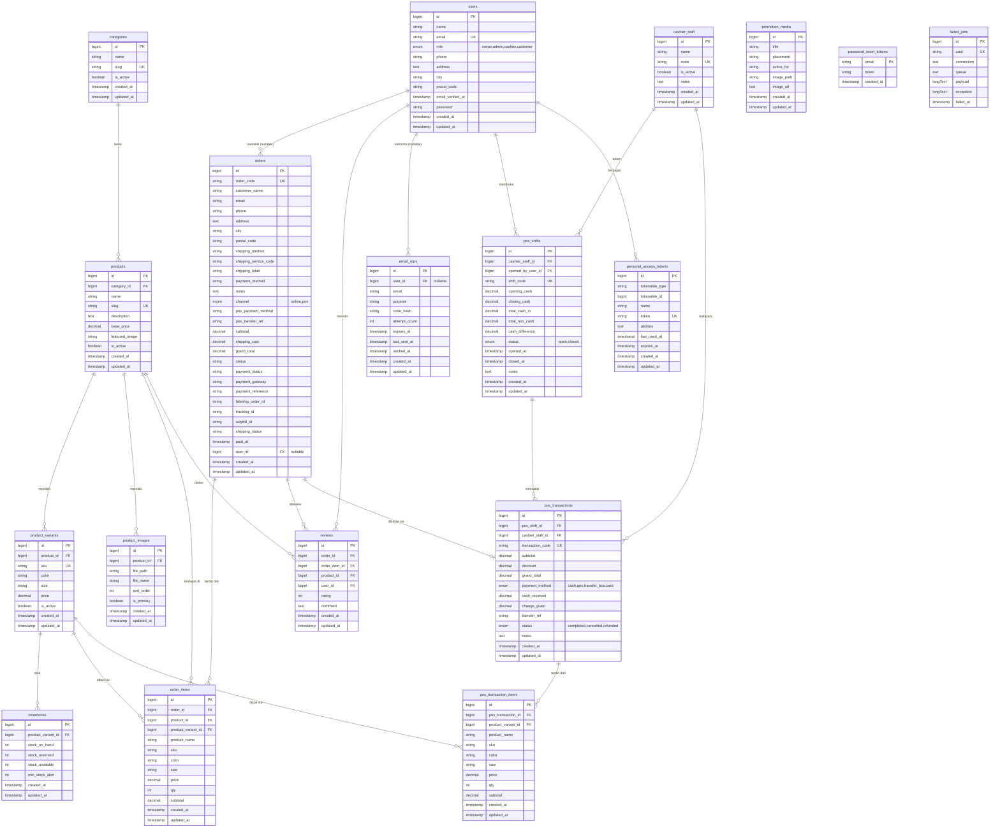

# Perancangan Basis Data — SRFashionStyle

> **Tujuan**: Dokumentasi perancangan basis data untuk laporan akhir Kerja Praktek
> **Cakupan**: Seluruh tabel pada sistem backend Laravel
> **Tools**: MySQL / MariaDB, Laravel Migration

---

## 1. Entity Relationship Diagram (ERD)



---

## 2. Transformasi ERD ke Skema Relasional

Proses transformasi dari model konseptual (ERD) ke skema relasional mengikuti aturan berikut:

### Aturan 1: Setiap Entitas Kuat → Satu Tabel

Setiap entitas pada ERD ditransformasikan menjadi satu tabel dengan primary key dari atribut kunci entitas tersebut.

| Entitas | Tabel | Primary Key |
|---------|-------|-------------|
| User | `users` | `id` |
| Category | `categories` | `id` |
| Product | `products` | `id` |
| ProductVariant | `product_variants` | `id` |
| ProductImage | `product_images` | `id` |
| Inventory | `inventories` | `id` |
| Order | `orders` | `id` |
| OrderItem | `order_items` | `id` |
| Review | `reviews` | `id` |
| CashierStaff | `cashier_staff` | `id` |
| PosShift | `pos_shifts` | `id` |
| PosTransaction | `pos_transactions` | `id` |
| PosTransactionItem | `pos_transaction_items` | `id` |
| EmailOtp | `email_otps` | `id` |
| PromotionMedia | `promotion_media` | `id` |

### Aturan 2: Relasi 1:N — Tambahkan FK di Sisi "Banyak"

Untuk setiap relasi *one-to-many*, foreign key ditambahkan pada tabel yang bersisi "banyak" (*N*), merujuk ke primary key tabel sisi "satu" (*1*).

| Relasi | FK pada Tabel | Merujuk ke |
|--------|---------------|-----------|
| User 1—N Order | `orders.user_id` (nullable) | `users.id` |
| User 1—N Review | `reviews.user_id` | `users.id` |
| User 1—N PosShift | `pos_shifts.opened_by_user_id` | `users.id` |
| Category 1—N Product | `products.category_id` | `categories.id` |
| Product 1—N ProductVariant | `product_variants.product_id` | `products.id` |
| Product 1—N ProductImage | `product_images.product_id` | `products.id` |
| ProductVariant 1—N Inventory | `inventories.product_variant_id` | `product_variants.id` |
| Order 1—N OrderItem | `order_items.order_id` | `orders.id` |
| CashierStaff 1—N PosShift | `pos_shifts.cashier_staff_id` | `cashier_staff.id` |
| CashierStaff 1—N PosTransaction | `pos_transactions.cashier_staff_id` | `cashier_staff.id` |
| PosShift 1—N PosTransaction | `pos_transactions.pos_shift_id` | `pos_shifts.id` |
| PosTransaction 1—N PosTransactionItem | `pos_transaction_items.pos_transaction_id` | `pos_transactions.id` |

### Aturan 3: Relasi M:N — Tabel Asosiasi

Relasi many-to-many antara `orders` dan `product_variants` dipecah melalui tabel asosiasi `order_items`. Tabel asosiasi ini memiliki dua FK yang masing-masing merujuk ke tabel induk:

| Tabel Asosiasi | FK 1 | FK 2 | FK 3 (konteks) |
|----------------|------|------|-----------------|
| `order_items` | `order_id` → `orders.id` | `product_variant_id` → `product_variants.id` | `product_id` → `products.id` |
| `pos_transaction_items` | `pos_transaction_id` → `pos_transactions.id` | `product_variant_id` → `product_variants.id` | — |
| `reviews` | `order_id` → `orders.id` | `user_id` → `users.id` | `order_item_id` → `order_items.id` |

### Aturan 4: Relasi 1:1 — FK Unik atau Merge

Pada sistem ini tidak terdapat relasi *one-to-one* murni. Relasi `orders` ke `pos_transactions` bersifat opsional (satu order online mungkin tidak memiliki transaksi POS, dan satu transaksi POS selalu merujuk ke satu order *pay-at-store*). Implementasi dilakukan melalui query aplikasi, bukan constraint database.

### Aturan 5: Atribut Multivalue → Tabel Terpisah

Atribut `images` pada entitas `Product` yang bersifat multivalue ditransformasikan menjadi tabel `product_images` dengan FK ke `products`.

---

## 3. Logical Record Structure (LRS)

LRS menyajikan struktur tabel akhir setelah transformasi, dengan hanya menampilkan: nama tabel, nama kolom, tipe data, primary key (PK), foreign key (FK), dan unique key (UK).

```
┌─────────────────────────────────────────────────────────────────────────────────────┐
│                               LOGICAL RECORD STRUCTURE                                │
│                                   SRFashionStyle                                      │
├─────────────────────────────────────────────────────────────────────────────────────┤
│                                                                                      │
│  ┌─────────────────────────────┐       ┌─────────────────────────────┐              │
│  │           users             │       │         categories          │              │
│  ├─────────────────────────────┤       ├─────────────────────────────┤              │
│  │ PK  id          BIGINT      │       │ PK  id          BIGINT      │              │
│  │     name        VARCHAR(255)│       │     name        VARCHAR(255)│              │
│  │ UK  email       VARCHAR(255)│       │ UK  slug        VARCHAR(255)│              │
│  │     role        ENUM        │       │     is_active   BOOLEAN     │              │
│  │     phone       VARCHAR(20) │       │     created_at  TIMESTAMP   │              │
│  │     address     TEXT        │       │     updated_at  TIMESTAMP   │              │
│  │     city        VARCHAR(255)│       └─────────────────────────────┘              │
│  │     postal_code VARCHAR(10) │                         │                          │
│  │     email_verified_at       │                         │ 1                        │
│  │     password    VARCHAR(255)│                         │                          │
│  │     remember_token          │                         │                          │
│  │     created_at  TIMESTAMP   │                         ▼ N                        │
│  │     updated_at  TIMESTAMP   │       ┌─────────────────────────────┐              │
│  └─────────────────────────────┘       │          products           │              │
│            │              │            ├─────────────────────────────┤              │
│            │ 1            │ 1          │ PK  id          BIGINT      │              │
│            │              │            │ FK  category_id BIGINT      │              │
│            ▼ N            ▼ N          │     name        VARCHAR(255)│              │
│  ┌──────────────────┐ ┌──────────────┐ │ UK  slug        VARCHAR(255)│              │
│  │     orders       │ │  email_otps  │ │     description TEXT        │              │
│  ├──────────────────┤ ├──────────────┤ │     base_price DECIMAL(12,2)│              │
│  │PK id    BIGINT   │ │PK id BIGINT  │ │     featured_image          │              │
│  │UK order_code     │ │FK user_id    │ │     is_active   BOOLEAN     │              │
│  │   customer_name  │ │   email      │ │     created_at  TIMESTAMP   │              │
│  │   email          │ │   purpose    │ │     updated_at  TIMESTAMP   │              │
│  │   phone          │ │   code_hash  │ └─────────────────────────────┘              │
│  │   address  TEXT  │ │   attempt_cnt│       │         │          │                │
│  │   city           │ │   expires_at │       │ 1       │ 1        │ 1              │
│  │   postal_code    │ │   last_sent  │       │         │          │                │
│  │   shipping_method│ │   verified_at│       ▼ N       ▼ N        ▼ N              │
│  │   payment_method │ │   created_at │ ┌──────────┐ ┌────────┐ ┌───────────────┐  │
│  │   channel  ENUM  │ │   updated_at │ │product_  │ │product │ │ order_items   │  │
│  │   subtotal       │ └──────────────┘ │images    │ │variants│ ├───────────────┤  │
│  │   shipping_cost  │                  ├──────────┤ ├────────┤ │PK id  BIGINT  │  │
│  │   grand_total    │                  │PK id     │ │PK id   │ │FK order_id    │  │
│  │   status         │                  │FK prod_id│ │FK prod │ │FK product_id  │  │
│  │   payment_status │                  │file_path │ │  _id   │ │FK pr_var_id   │  │
│  │   payment_gateway│                  │file_name │ │UK sku  │ │  product_name │  │
│  │   payment_ref    │                  │sort_order│ │  color │ │  sku          │  │
│  │   biteship_ord_id│                  │is_primary│ │  size  │ │  color        │  │
│  │   tracking_id    │                  │created_at│ │  price │ │  size         │  │
│  │   waybill_id     │                  │updated_at│ │  is_act│ │  price        │  │
│  │   shipping_status│                  └──────────┘ │created │ │  qty          │  │
│  │   paid_at        │                        ▲      │updated │ │  subtotal     │  │
│  │FK user_id (null) │                        │      └────────┘ │  created_at   │  │
│  │   created_at     │                        │          │       │  updated_at   │  │
│  │   updated_at     │                        │          │ 1     └───────────────┘  │
│  └──────────────────┘                        │          │               │          │
│            │                                 │          │               │ 1        │
│            │ 1                               │          ▼ 1:1           │          │
│            │                                 │  ┌───────────────┐       ▼ 1        │
│            ▼ N                               │  │  inventories  │  ┌────────────┐  │
│  ┌──────────────────┐                        │  ├───────────────┤  │  reviews   │  │
│  │  pos_transactions│                        │  │PK id  BIGINT  │  ├────────────┤  │
│  ├──────────────────┤                        │  │FK pr_var_id   │  │PK id BIGINT│  │
│  │PK id    BIGINT   │                        │  │  stock_on_hand│  │FK order_id │  │
│  │FK pos_shift_id   │                        │  │  stock_reserv │  │FK ord_item │  │
│  │FK cashier_stf_id │                        │  │  stock_avail  │  │FK prod_id  │  │
│  │UK transaction_cd │                        │  │  min_stock    │  │FK user_id  │  │
│  │   subtotal       │                        │  │  created_at   │  │  rating    │  │
│  │   discount       │                        │  │  updated_at   │  │  comment   │  │
│  │   grand_total    │                        │  └───────────────┘  │  created_at│  │
│  │   payment_method │                        │                     │  updated_at│  │
│  │   cash_received  │                        │  ┌───────────────┐  └────────────┘  │
│  │   change_given   │                        │  │   promotion   │                  │
│  │   transfer_ref   │                        │  │    _media     │                  │
│  │   status   ENUM  │                        │  ├───────────────┤                  │
│  │   notes    TEXT  │                        │  │PK id  BIGINT  │                  │
│  │   created_at     │                        │  │  title        │                  │
│  │   updated_at     │                        │  │  placement    │                  │
│  └──────────────────┘                        │  │  active_for   │                  │
│            │                                 │  │  image_path   │                  │
│            │ 1                               │  │  image_url    │                  │
│            │                                 │  │  created_at   │                  │
│            ▼ N                               │  │  updated_at   │                  │
│  ┌──────────────────────┐                    │  └───────────────┘                  │
│  │ pos_transaction_items│                    │                                      │
│  ├──────────────────────┤                    │                                      │
│  │PK id      BIGINT     │                    │                                      │
│  │FK pos_tr_id          │                    │                                      │
│  │FK product_variant_id │                    │                                      │
│  │   product_name       │                    │                                      │
│  │   sku                │                    │                                      │
│  │   color              │                    │                                      │
│  │   size               │                    │                                      │
│  │   price   DECIMAL    │                    │                                      │
│  │   qty     INT        │                    │                                      │
│  │   subtotal DECIMAL   │                    │                                      │
│  │   created_at         │                    │                                      │
│  │   updated_at         │                    │                                      │
│  └──────────────────────┘                    │                                      │
│                                              │                                      │
│  ┌────────────────┐     ┌────────────────┐   │                                      │
│  │ cashier_staff  │     │   pos_shifts   │   │                                      │
│  ├────────────────┤     ├────────────────┤   │                                      │
│  │PK id  BIGINT   │◄──┐  │PK id  BIGINT  │   │                                      │
│  │   name         │   │  │FK cash_stf_id │   │                                      │
│  │UK code         │   └──│FK opened_by   │   │                                      │
│  │   is_active    │      │      _user_id │   │                                      │
│  │   notes  TEXT  │      │UK shift_code  │   │                                      │
│  │   created_at   │      │  opening_cash │   │                                      │
│  │   updated_at   │      │  closing_cash │   │                                      │
│  └────────────────┘      │  total_cash_in│   │                                      │
│         │                │  total_noncash│   │                                      │
│         │ 1              │  cash_differ  │   │                                      │
│         │                │  status  ENUM │   │                                      │
│         ▼ N              │  opened_at    │   │                                      │
│  ┌────────────────┐      │  closed_at    │   │                                      │
│  │pos_transactions│◄─────│  notes  TEXT  │   │                                      │
│  │  (lanjutan)    │  N:1 │  created_at   │   │                                      │
│  └────────────────┘      │  updated_at   │   │                                      │
│                          └───────────────┘   │                                      │
│                                              │                                      │
│  ┌──────────────────────┐                    │                                      │
│  │ personal_access_token│                    │                                      │
│  ├──────────────────────┤                    │                                      │
│  │PK id       BIGINT    │                    │                                      │
│  │   tokenable_type     │                    │                                      │
│  │   tokenable_id       │                    │                                      │
│  │UK token   VARCHAR(64)│                    │                                      │
│  │   name               │                    │                                      │
│  │   abilities   TEXT   │                    │                                      │
│  │   last_used_at       │                    │                                      │
│  │   expires_at         │                    │                                      │
│  └──────────────────────┘                    │                                      │
│                                              │                                      │
└─────────────────────────────────────────────────────────────────────────────────────┘
```

---

## 4. Kamus Data (Data Dictionary)

### 4.1 Tabel `users`
| Kolom | Tipe | Constraint | Keterangan |
|-------|------|-----------|------------|
| id | BIGINT UNSIGNED | PK, AUTO_INCREMENT | ID unik user |
| name | VARCHAR(255) | NOT NULL | Nama lengkap |
| email | VARCHAR(255) | NOT NULL, UNIQUE | Alamat email (lowercase) |
| role | ENUM('owner','admin','cashier','customer') | NOT NULL, DEFAULT 'customer' | Peran pengguna |
| phone | VARCHAR(20) | NULLABLE | Nomor telepon |
| address | TEXT | NULLABLE | Alamat rumah |
| city | VARCHAR(255) | NULLABLE | Kota |
| postal_code | VARCHAR(10) | NULLABLE | Kode pos |
| email_verified_at | TIMESTAMP | NULLABLE | Waktu verifikasi email |
| password | VARCHAR(255) | NOT NULL | Hash password (bcrypt) |
| remember_token | VARCHAR(100) | NULLABLE | Token "remember me" |
| created_at | TIMESTAMP | NULLABLE | Waktu pendaftaran |
| updated_at | TIMESTAMP | NULLABLE | Waktu pembaruan terakhir |

### 4.2 Tabel `categories`
| Kolom | Tipe | Constraint | Keterangan |
|-------|------|-----------|------------|
| id | BIGINT UNSIGNED | PK, AUTO_INCREMENT | ID unik kategori |
| name | VARCHAR(255) | NOT NULL | Nama kategori |
| slug | VARCHAR(255) | NOT NULL, UNIQUE | URL-friendly slug |
| is_active | BOOLEAN | NOT NULL, DEFAULT true | Status aktif |
| created_at | TIMESTAMP | NULLABLE | — |
| updated_at | TIMESTAMP | NULLABLE | — |

### 4.3 Tabel `products`
| Kolom | Tipe | Constraint | Keterangan |
|-------|------|-----------|------------|
| id | BIGINT UNSIGNED | PK, AUTO_INCREMENT | ID unik produk |
| category_id | BIGINT UNSIGNED | FK → categories(id), NOT NULL | Kategori produk |
| name | VARCHAR(255) | NOT NULL | Nama produk |
| slug | VARCHAR(255) | NOT NULL, UNIQUE | URL-friendly slug |
| description | TEXT | NULLABLE | Deskripsi produk |
| base_price | DECIMAL(12,2) | NOT NULL, DEFAULT 0 | Harga dasar |
| featured_image | VARCHAR(255) | NULLABLE | Gambar utama |
| is_active | BOOLEAN | NOT NULL, DEFAULT true | Status aktif |
| created_at | TIMESTAMP | NULLABLE | — |
| updated_at | TIMESTAMP | NULLABLE | — |

**FK Cascade**: `category_id` → ON UPDATE CASCADE, ON DELETE RESTRICT

### 4.4 Tabel `product_variants`
| Kolom | Tipe | Constraint | Keterangan |
|-------|------|-----------|------------|
| id | BIGINT UNSIGNED | PK, AUTO_INCREMENT | ID unik varian |
| product_id | BIGINT UNSIGNED | FK → products(id), NOT NULL | Produk induk |
| sku | VARCHAR(100) | NOT NULL, UNIQUE | Kode SKU |
| color | VARCHAR(50) | NULLABLE | Warna |
| size | VARCHAR(20) | NULLABLE | Ukuran |
| price | DECIMAL(12,2) | NOT NULL | Harga varian |
| is_active | BOOLEAN | NOT NULL, DEFAULT true | Status aktif |
| created_at | TIMESTAMP | NULLABLE | — |
| updated_at | TIMESTAMP | NULLABLE | — |

**FK Cascade**: `product_id` → ON DELETE CASCADE

### 4.5 Tabel `product_images`
| Kolom | Tipe | Constraint | Keterangan |
|-------|------|-----------|------------|
| id | BIGINT UNSIGNED | PK, AUTO_INCREMENT | ID unik gambar |
| product_id | BIGINT UNSIGNED | FK → products(id), NOT NULL | Produk terkait |
| file_path | VARCHAR(255) | NOT NULL | Path file di storage |
| file_name | VARCHAR(255) | NULLABLE | Nama file asli |
| sort_order | INT | NOT NULL, DEFAULT 0 | Urutan tampil |
| is_primary | BOOLEAN | NOT NULL, DEFAULT false | Gambar utama? |
| created_at | TIMESTAMP | NULLABLE | — |
| updated_at | TIMESTAMP | NULLABLE | — |

**FK Cascade**: `product_id` → ON DELETE CASCADE

### 4.6 Tabel `inventories`
| Kolom | Tipe | Constraint | Keterangan |
|-------|------|-----------|------------|
| id | BIGINT UNSIGNED | PK, AUTO_INCREMENT | ID unik inventory |
| product_variant_id | BIGINT UNSIGNED | FK → product_variants(id), NOT NULL | Varian terkait |
| stock_on_hand | INT | NOT NULL, DEFAULT 0 | Stok fisik |
| stock_reserved | INT | NOT NULL, DEFAULT 0 | Stok dipesan (belum dibayar) |
| stock_available | INT | NOT NULL, DEFAULT 0 | Stok tersedia → stock_on_hand - stock_reserved |
| min_stock_alert | INT | NOT NULL, DEFAULT 0 | Batas minimum stok |
| created_at | TIMESTAMP | NULLABLE | — |
| updated_at | TIMESTAMP | NULLABLE | — |

**FK Cascade**: `product_variant_id` → ON DELETE CASCADE

### 4.7 Tabel `orders`
| Kolom | Tipe | Constraint | Keterangan |
|-------|------|-----------|------------|
| id | BIGINT UNSIGNED | PK, AUTO_INCREMENT | ID unik order |
| order_code | VARCHAR(255) | NOT NULL, UNIQUE | Kode order (generated) |
| customer_name | VARCHAR(255) | NOT NULL | Nama pemesan |
| email | VARCHAR(255) | NOT NULL | Email pemesan |
| phone | VARCHAR(20) | NOT NULL | Telepon pemesan |
| address | TEXT | NOT NULL | Alamat pengiriman |
| city | VARCHAR(255) | NOT NULL | Kota pengiriman |
| postal_code | VARCHAR(10) | NOT NULL | Kode pos pengiriman |
| shipping_method | VARCHAR(255) | NULLABLE | jnt / pickup |
| shipping_service_code | VARCHAR(255) | NULLABLE | Kode layanan J&T |
| shipping_label | VARCHAR(255) | NULLABLE | Label layanan |
| payment_method | VARCHAR(100) | NOT NULL | Metode pembayaran |
| notes | TEXT | NULLABLE | Catatan |
| channel | ENUM('online','pos') | NOT NULL, DEFAULT 'online' | Channel penjualan |
| pos_payment_method | VARCHAR(50) | NULLABLE | Metode bayar POS (cash/qris/transfer_bca) |
| pos_transfer_ref | VARCHAR(100) | NULLABLE | Nomor referensi transfer (POS) |
| subtotal | DECIMAL(15,2) | NOT NULL, DEFAULT 0 | Subtotal item |
| shipping_cost | DECIMAL(15,2) | NOT NULL, DEFAULT 0 | Ongkos kirim |
| grand_total | DECIMAL(15,2) | NOT NULL, DEFAULT 0 | Total akhir |
| status | VARCHAR(255) | NOT NULL, DEFAULT 'pending' | pending / processing / shipped / completed / cancelled |
| payment_status | VARCHAR(255) | NOT NULL, DEFAULT 'pending' | pending / paid / failed / expired |
| payment_gateway | VARCHAR(255) | NULLABLE | midtrans |
| payment_reference | VARCHAR(255) | NULLABLE | Referensi dari gateway |
| biteship_order_id | VARCHAR(255) | NULLABLE | ID order di Biteship |
| tracking_id | VARCHAR(255) | NULLABLE | ID tracking Biteship |
| waybill_id | VARCHAR(255) | NULLABLE | Nomor resi |
| shipping_status | VARCHAR(255) | NULLABLE | Status dari Biteship |
| paid_at | TIMESTAMP | NULLABLE | Waktu pembayaran sukses |
| user_id | BIGINT UNSIGNED | FK → users(id), NULLABLE, ON DELETE SET NULL | User terautentikasi |
| created_at | TIMESTAMP | NULLABLE | — |
| updated_at | TIMESTAMP | NULLABLE | — |

### 4.8 Tabel `order_items`
| Kolom | Tipe | Constraint | Keterangan |
|-------|------|-----------|------------|
| id | BIGINT UNSIGNED | PK, AUTO_INCREMENT | ID unik item |
| order_id | BIGINT UNSIGNED | FK → orders(id), NOT NULL | Order terkait |
| product_id | BIGINT UNSIGNED | FK → products(id), NOT NULL | Produk |
| product_variant_id | BIGINT UNSIGNED | FK → product_variants(id), NOT NULL | Varian yang dipilih |
| product_name | VARCHAR(255) | NOT NULL | Snapshot nama produk |
| sku | VARCHAR(100) | NOT NULL | Snapshot SKU |
| color | VARCHAR(50) | NULLABLE | Snapshot warna |
| size | VARCHAR(20) | NULLABLE | Snapshot ukuran |
| price | DECIMAL(15,2) | NOT NULL | Harga satuan saat order |
| qty | INT | NOT NULL | Jumlah |
| subtotal | DECIMAL(15,2) | NOT NULL | price × qty |
| created_at | TIMESTAMP | NULLABLE | — |
| updated_at | TIMESTAMP | NULLABLE | — |

**FK Cascade**: `order_id`, `product_id`, `product_variant_id` → ON DELETE CASCADE

### 4.9 Tabel `reviews`
| Kolom | Tipe | Constraint | Keterangan |
|-------|------|-----------|------------|
| id | BIGINT UNSIGNED | PK, AUTO_INCREMENT | ID unik ulasan |
| order_id | BIGINT UNSIGNED | FK → orders(id), NOT NULL | Order terkait |
| order_item_id | BIGINT UNSIGNED | FK → order_items(id), NOT NULL | Item yang diulas |
| product_id | BIGINT UNSIGNED | FK → products(id), NOT NULL | Produk yang diulas |
| user_id | BIGINT UNSIGNED | FK → users(id), NOT NULL | Pemberi ulasan |
| rating | TINYINT UNSIGNED | NOT NULL | Rating 1–5 |
| comment | TEXT | NULLABLE | Isi ulasan |
| created_at | TIMESTAMP | NULLABLE | — |
| updated_at | TIMESTAMP | NULLABLE | — |

**Unique**: (`order_item_id`, `user_id`) — satu ulasan per item per user
**FK Cascade**: Semua FK → ON DELETE CASCADE

### 4.10 Tabel `cashier_staff`
| Kolom | Tipe | Constraint | Keterangan |
|-------|------|-----------|------------|
| id | BIGINT UNSIGNED | PK, AUTO_INCREMENT | ID unik kasir |
| name | VARCHAR(100) | NOT NULL | Nama kasir |
| code | VARCHAR(20) | NOT NULL, UNIQUE | Kode unik kasir |
| is_active | BOOLEAN | NOT NULL, DEFAULT true | Status aktif |
| notes | TEXT | NULLABLE | Catatan |
| created_at | TIMESTAMP | NULLABLE | — |
| updated_at | TIMESTAMP | NULLABLE | — |

### 4.11 Tabel `pos_shifts`
| Kolom | Tipe | Constraint | Keterangan |
|-------|------|-----------|------------|
| id | BIGINT UNSIGNED | PK, AUTO_INCREMENT | ID unik shift |
| cashier_staff_id | BIGINT UNSIGNED | FK → cashier_staff(id), NOT NULL | Kasir bertugas |
| opened_by_user_id | BIGINT UNSIGNED | FK → users(id), NOT NULL | User pembuka shift |
| shift_code | VARCHAR(50) | NOT NULL, UNIQUE | Kode shift (generated) |
| opening_cash | DECIMAL(15,2) | NOT NULL, DEFAULT 0 | Saldo awal |
| closing_cash | DECIMAL(15,2) | NULLABLE | Saldo akhir (diisi saat close) |
| total_cash_in | DECIMAL(15,2) | NOT NULL, DEFAULT 0 | Total transaksi tunai |
| total_non_cash | DECIMAL(15,2) | NOT NULL, DEFAULT 0 | Total transaksi non-tunai |
| cash_difference | DECIMAL(15,2) | NULLABLE | Selisih → closing_cash - (opening_cash + total_cash_in) |
| status | ENUM('open','closed') | NOT NULL, DEFAULT 'open' | Status shift |
| opened_at | TIMESTAMP | NOT NULL, DEFAULT CURRENT_TIMESTAMP | Waktu buka |
| closed_at | TIMESTAMP | NULLABLE | Waktu tutup |
| notes | TEXT | NULLABLE | Catatan |
| created_at | TIMESTAMP | NULLABLE | — |
| updated_at | TIMESTAMP | NULLABLE | — |

### 4.12 Tabel `pos_transactions`
| Kolom | Tipe | Constraint | Keterangan |
|-------|------|-----------|------------|
| id | BIGINT UNSIGNED | PK, AUTO_INCREMENT | ID unik transaksi |
| pos_shift_id | BIGINT UNSIGNED | FK → pos_shifts(id), NOT NULL | Shift terkait |
| cashier_staff_id | BIGINT UNSIGNED | FK → cashier_staff(id), NOT NULL | Kasir pelaksana |
| transaction_code | VARCHAR(50) | NOT NULL, UNIQUE | Kode transaksi (generated) |
| subtotal | DECIMAL(15,2) | NOT NULL, DEFAULT 0 | Subtotal item |
| discount | DECIMAL(15,2) | NOT NULL, DEFAULT 0 | Diskon |
| grand_total | DECIMAL(15,2) | NOT NULL, DEFAULT 0 | Total akhir |
| payment_method | ENUM('cash','qris','transfer_bca','card') | NOT NULL, DEFAULT 'cash' | Metode bayar |
| cash_received | DECIMAL(15,2) | NULLABLE | Uang diterima (cash) |
| change_given | DECIMAL(15,2) | NULLABLE | Kembalian (cash) |
| transfer_ref | VARCHAR(100) | NULLABLE | Nomor referensi transfer |
| status | ENUM('completed','cancelled','refunded') | NOT NULL, DEFAULT 'completed' | Status transaksi |
| notes | TEXT | NULLABLE | Catatan |
| created_at | TIMESTAMP | NULLABLE | — |
| updated_at | TIMESTAMP | NULLABLE | — |

### 4.13 Tabel `pos_transaction_items`
| Kolom | Tipe | Constraint | Keterangan |
|-------|------|-----------|------------|
| id | BIGINT UNSIGNED | PK, AUTO_INCREMENT | ID unik item |
| pos_transaction_id | BIGINT UNSIGNED | FK → pos_transactions(id), NOT NULL | Transaksi terkait |
| product_variant_id | BIGINT UNSIGNED | FK → product_variants(id), NOT NULL | Varian produk |
| product_name | VARCHAR(200) | NOT NULL | Snapshot nama produk |
| sku | VARCHAR(100) | NULLABLE | Snapshot SKU |
| color | VARCHAR(100) | NULLABLE | Snapshot warna |
| size | VARCHAR(50) | NULLABLE | Snapshot ukuran |
| price | DECIMAL(15,2) | NOT NULL | Harga satuan |
| qty | INT | NOT NULL | Jumlah |
| subtotal | DECIMAL(15,2) | NOT NULL | price × qty |
| created_at | TIMESTAMP | NULLABLE | — |
| updated_at | TIMESTAMP | NULLABLE | — |

**FK Cascade**: `pos_transaction_id` → ON DELETE CASCADE

### 4.14 Tabel `email_otps`
| Kolom | Tipe | Constraint | Keterangan |
|-------|------|-----------|------------|
| id | BIGINT UNSIGNED | PK, AUTO_INCREMENT | ID unik OTP |
| user_id | BIGINT UNSIGNED | FK → users(id), NULLABLE, ON DELETE SET NULL | User terkait |
| email | VARCHAR(255) | NOT NULL, INDEX | Email tujuan |
| purpose | VARCHAR(255) | NOT NULL, DEFAULT 'verify_email', INDEX | Tujuan OTP |
| code_hash | VARCHAR(255) | NOT NULL | Hash dari kode OTP 6 digit |
| attempt_count | INT UNSIGNED | NOT NULL, DEFAULT 0 | Jumlah percobaan verifikasi |
| expires_at | TIMESTAMP | NOT NULL | Waktu kadaluarsa (+10 menit) |
| last_sent_at | TIMESTAMP | NULLABLE | Waktu kirim terakhir |
| verified_at | TIMESTAMP | NULLABLE | Waktu verifikasi sukses |
| created_at | TIMESTAMP | NULLABLE | — |
| updated_at | TIMESTAMP | NULLABLE | — |

**Composite Index**: (`email`, `purpose`)

### 4.15 Tabel `promotion_media`
| Kolom | Tipe | Constraint | Keterangan |
|-------|------|-----------|------------|
| id | BIGINT UNSIGNED | PK, AUTO_INCREMENT | ID unik media |
| title | VARCHAR(255) | NULLABLE | Judul media |
| placement | VARCHAR(255) | NULLABLE | Posisi: hero_desktop / hero_mobile / promo |
| active_for | VARCHAR(255) | NULLABLE | Tipe penempatan aktif |
| image_path | VARCHAR(255) | NOT NULL | Path file gambar |
| image_url | TEXT | NOT NULL | URL akses gambar |
| created_at | TIMESTAMP | NULLABLE | — |
| updated_at | TIMESTAMP | NULLABLE | — |

---

## 5. Ringkasan Relasi Antar Tabel

```
users
  ├── (1:N) orders               [user_id nullable, SET NULL]
  ├── (1:N) reviews              [user_id, CASCADE]
  ├── (1:N) email_otps           [user_id nullable, SET NULL]
  ├── (1:N) pos_shifts           [opened_by_user_id, NO ACTION]
  └── (1:N) personal_access_tokens [polymorphic]

categories
  └── (1:N) products             [category_id, RESTRICT delete]

products
  ├── (1:N) product_variants     [product_id, CASCADE]
  ├── (1:N) product_images       [product_id, CASCADE]
  ├── (1:N) order_items          [product_id, CASCADE]
  └── (1:N) reviews              [product_id, CASCADE]

product_variants
  ├── (1:1) inventories          [product_variant_id, CASCADE]
  ├── (1:N) order_items          [product_variant_id, CASCADE]
  └── (1:N) pos_transaction_items [product_variant_id, NO ACTION]

orders
  ├── (1:N) order_items          [order_id, CASCADE]
  └── (1:N) reviews              [order_id, CASCADE]

cashier_staff
  ├── (1:N) pos_shifts           [cashier_staff_id, NO ACTION]
  └── (1:N) pos_transactions     [cashier_staff_id, NO ACTION]

pos_shifts
  └── (1:N) pos_transactions     [pos_shift_id, NO ACTION]

pos_transactions
  └── (1:N) pos_transaction_items [pos_transaction_id, CASCADE]
```

---

## 6. Aturan Bisnis pada Database

| # | Aturan | Implementasi |
|---|--------|-------------|
| 1 | Email user harus unik dan lowercase | Unique constraint + aplikasi `Str::lower()` |
| 2 | Satu user hanya boleh satu ulasan per item order | Composite unique (`order_item_id`, `user_id`) |
| 3 | Kategori tidak bisa dihapus jika masih ada produk | ON DELETE RESTRICT pada `products.category_id` |
| 4 | Hapus produk → hapus varian, gambar, item order, ulasan | ON DELETE CASCADE |
| 5 | Hapus varian → hapus inventory | ON DELETE CASCADE |
| 6 | Hapus order → hapus semua item dan ulasan | ON DELETE CASCADE |
| 7 | User yang sudah punya order tidak bisa dihapus (data dipertahankan) | `orders.user_id` → ON DELETE SET NULL |
| 8 | Hapus transaksi POS → hapus item transaksi | ON DELETE CASCADE |
| 9 | Shift yang sedang berjalan tidak bisa dihapus | Validasi di aplikasi (PHP) |
| 10 | Stok tersedia = stok fisik - stok dipesan | Kolom `stock_available` + logika aplikasi |
